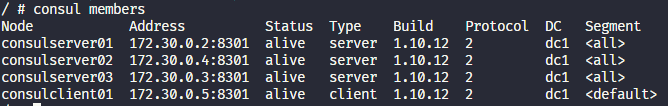

## Resumo

Módulo de Service Discovery com o Consul.

A ideia geral é criar servidores e clientes consul, utilizando a sua API e servidor DNS built-in para buscar os serviços disponíveis em determinado cluster.

### Comandos

- docker exec -it consulserver01 sh

- consul members

- consul join 172.30.0.4

- mkdir /etc/consul.d

- mkdir /var/lib/consul

- consul agent -server -bootstrap-expect=3 -node=consulserver02 -bind=172.30.0.4 -data-dir=/var/lib/consul -config-dir=/etc/consul.d

- consul agent -bind=172.30.0.5 -data-dir=/var/lib/consul -config-dir=/etc/consul.d

- apk -U add bind-tools

- dig @localhost -p 8600 nginx.service.consul

- consul catalog nodes -detailed 

